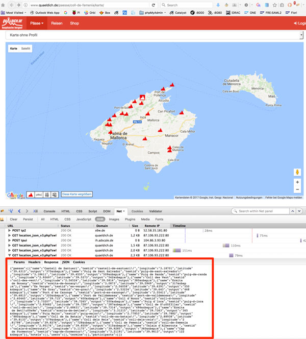

# Quäldich.de to GeoJSON

This small Perl script converts the Quäldich.de (http://www.quaeldich.de/) location JSON into a GeoJSON file.


## Example with the island of Mallorca

### View the map and locate location_json_v3.php

http://www.quaeldich.de/paesse/puig-major/karte/



### Download location JSON and convert to GeoJSON

```
curl -s -f 'http://www.quaeldich.de/webinclude/php/location_json_v3.php?swlon=1.3197287499999675&swlat=39.153399417839836&nelon=4.4508322656249675&nelat=40.41967792946016&items=0' | perl quaeldich2geojson.pl > mallorca.geojson
```

## Output

https://github.com/Cyclenerd/cyclenerd.github.io/blob/master/mallorca/paesse.geojson
