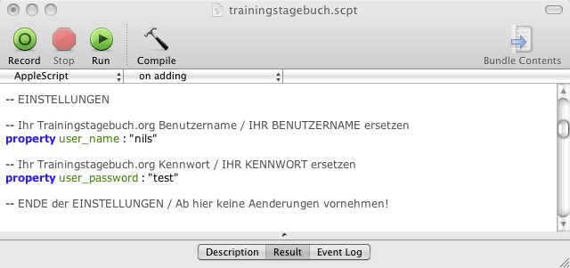

# Trainingstagebuch.org Ordneraktion Skript

Ein MacOS X Ordneraktion Skript für den automatischen Import von Trainingsdateien (HRM, TCX) zu http://trainingstagebuch.org/

## So wird's gemacht!

Speichern Sie das Skript `trainingstagebuch.scpt` unter

    ~/Library/Scripts/Folder Action Scripts

(Heimordner -> Library -> Scripts -> Folder Action Scripts)

Sollte dieser Ordner noch nicht existieren, erstellen Sie ihn einfach.

### Einstellungen ändern

Öffnen Sie das Skript `trainingstagebuch.scpt` und passen Sie Ihren Trainingstagebuch.org-Benutzernamen und Kennwort an. Speichern Sie Ihre Veränderungen (Tastenkombination <kbd>CMD</kbd> + <kbd>S</kbd>).

### Ordner erstellen

* Erstellen Sie sich einen neuen leeren Ordner (zum Beispiel "Upload in mein Trainingstagebuch" auf dem "Schreibtisch")
* Wählen Sie den Ordner aus, dem Sie die Trainingstagebuch-Ordneraktion zuweisen möchten und klicken Sie bei gedrückter Taste <kbd>CTRL</kbd> (oder mit der rechten Maustaste) auf den Ordner.
* Wählen Sie "Mehr" ->"Ordneraktionen konfigurieren" aus dem Kontextmenü aus.
* Anschließend wird das Dialogfenster "Ordneraktionen konfigurieren" geöffnet, in dem Sie verschiedene Skripts aktivieren und deaktivieren können.
* Klicken Sie auf das Pluszeichen (+) unten links im Dialogfenster, damit Ihr neuer Order in die Liste aufgenommen wird.
* Danach wird ein Fenster mit einer Liste der integrierten Skripts angezeigt, die Sie diesem Ordner zuweisen können.
* Wählen Sie das Skript "trainingstagebuch.scpt" aus. (Sollten Sie dieses Skript nicht zur Auswahl haben, überprüfen Sie bitte unter Punkt 2 beschriebenes Vorgehen.)
* Klicken Sie auf die Taste "Anhängen", damit Ihr gerade zugewiesenes Skript rechts im Fenster in der Spalte angezeigt wird. Klicken Sie dann auf das Feld "Ordneraktionen aktivieren" oben links im Dialogfenster. Hiermit werden die Ordneraktionen generell aktiviert und deaktiviert.

### Fertig

Sie können jetzt Polar HRM- und Garmin TCX-Dateien in den Ordner kopieren (verschieben). Alle Dateien werden automatisch in Ihr Trainingstagebuch importiert.
