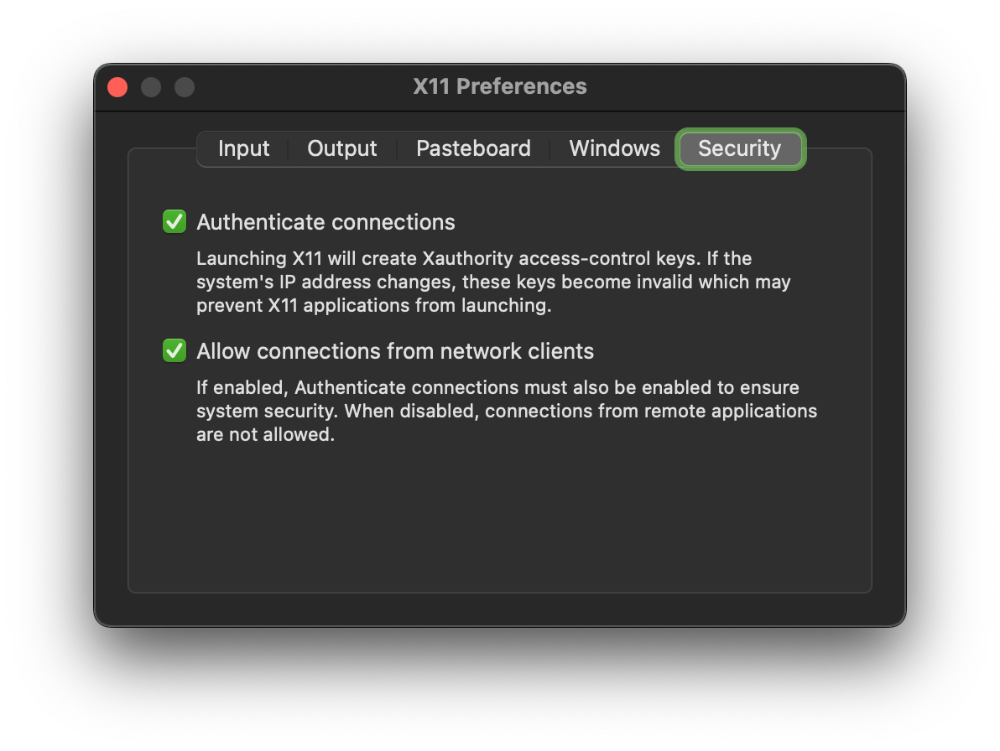
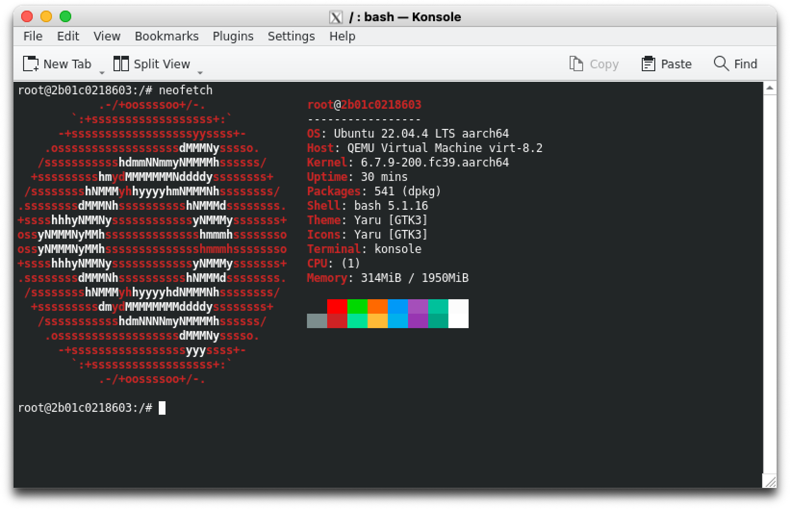

# XQuartz

Website: <https://www.xquartz.org/>

> The XQuartz project is an open-source effort to develop a version of the X.Org X Window System that runs on macOS.
> Together with supporting libraries and applications, it forms the X11.app that Apple shipped with OS X versions 10.5 through 10.7.

```shell
brew install --cask xquartz
```

Change settings:



## Container

Build container:

```bash
podman build . --tag "konsole:test"
```

Run container:

```bash
podman run \
    -v /tmp/.X11-unix:/tmp/.X11-unix \
    -v ~/.Xauthority:/tmp/.Xauthority \
    -e DISPLAY=[MAC-IP]:0 \
    --name konsole konsole:test
```

Get local IP (`MAC-IP`):

```bash
# LAN
ipconfig getifaddr en0
# WiFi
ipconfig getifaddr en1
```

Start:

```bash
podman start konsole
```

Konsole (from Container):

