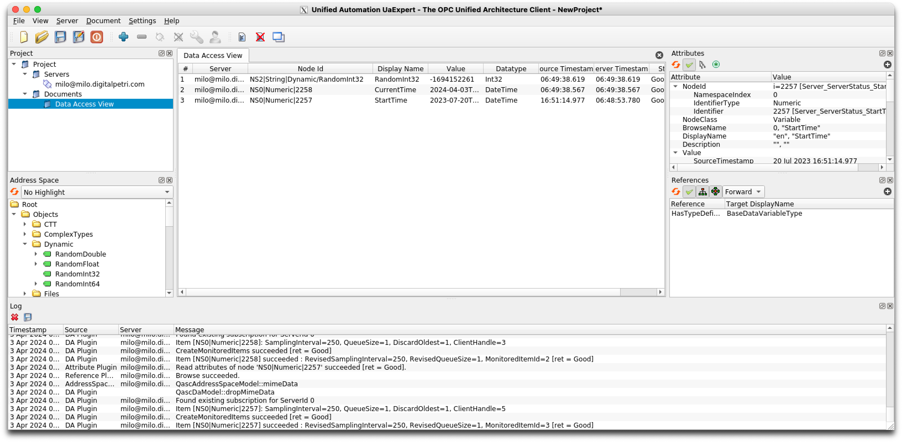
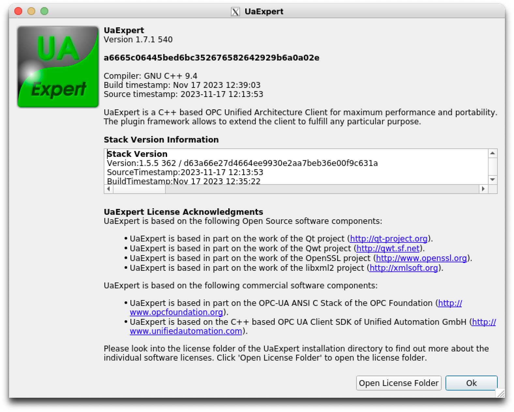

# UaExpert OPC-UA Client

**Build and Deploy UaExpert with Docker or Podman on Apple macOS**

This repository provides a Dockerfile to build and deploy the [UaExpert](https://www.unified-automation.com/downloads/opc-ua-clients.html) OPC-UA client on Apple macOS.

> Tested with UaExpert version 1.7.1. and Apple macOS 14 (Apple Silicon) with Podman version 4.9.3

Idea and inspiration by  <https://github.com/Deadlyelder/OPC-UA-Expert-Docker>.

**The challenge:**

UaExpert is officially available for Linux and Windows only.
Using it on Apple macOS can be cumbersome without a virtual machine (VM).

**The solution:**

This Docker container image leverages [XQuartz](https://github.com/Cyclenerd/toolbox/tree/master/xquartz#readme), an X11 server for Apple macOS, to provide a graphical environment within the container.
This allows you to run UaExpert on your Mac without a VM.

**Benefits:**

* Simple Setup: No need to set-up a VM separately.
* Isolated Environment: Run UaExpert in a self-contained container.
* Easy Testing: Quickly test and interact with OPC-UA servers on your Mac.

**Getting started:**

1. Setup XQuartz (<https://github.com/Cyclenerd/toolbox/tree/master/xquartz#readme>)
1. Install Podman (`brew install --cask podman-desktop`)
1. Download `UaExpert App.Image File - Linux x86/64` ([Link](https://www.unified-automation.com/downloads/opc-ua-clients.html))
1. Extract the file:
    ```basah
    tar xvfz uaexpert-bin-linux-x86_64-1.7.1-540.tar.gz
    ```
1. Move AppImage file to this folder and rename it to `uaexpert-bin-linux-x86_64.AppImage`:
    ```bash
    mv uaexpert-bin-linux-x86_64-1.7.1-540.AppImage [...]/opc-ua-clients/uaexpert-bin-linux-x86_64.AppImage
    ```
1. Build container for Intel and AMD x84_64 systems (`linux/amd64`) not ARM aarch64 (Apple Silicon):
    ```bash
    podman build --platform "linux/amd64" --tag "uaexpert:1.7.1" .
    ```

**Run container:**

> Important: Set the `ulimit` for open files (`-n`) to 1024!
> ([Details](https://forum.unified-automation.com/viewtopic.php?f=22&t=8222))

```bash
podman run \
    --platform "linux/amd64" \
    --ulimit nofile=1024:1024 \
    -v /tmp/.X11-unix:/tmp/.X11-unix \
    -v ~/.Xauthority:/tmp/.Xauthority \
    -e DISPLAY=[MAC-IP]:0 \
    --name uaexpert uaexpert:1.7.1
```

## Screenshots

Server:



About:




